# Lion Roaring Automation Framework Implementation Report

**Prepared for:** Lion Roaring  
**Developed by:** Excellis IT Pvt. Ltd.  
**Access:** Super Admin only (PMA → Documentation)  
**Source attachment:** [Lion_Roaring_Automation_Framework_Implementation_Report.docx](attachments/Lion_Roaring_Automation_Framework_Implementation_Report.docx)

## 1. Executive Summary

The Lion Roaring Automation Framework was developed to automate repetitive administrative workflows within the Lion Roaring web application. The automation suite was implemented using Python and Selenium WebDriver with a reusable framework architecture to improve regression testing efficiency, reduce manual effort, and ensure consistent execution across critical business modules.

The framework automates business-critical operations such as authentication, member management, role management, membership configuration, promotional code management, messaging, reporting, and audit log validation. Each automation follows a standardized execution process that includes browser initialization, authentication, business workflow execution, validation, logging, screenshot capture, and browser cleanup.

## 2. Project Objective

The objective of this automation implementation was to:

- Reduce repetitive manual testing.
- Improve regression testing efficiency.
- Increase consistency of test execution.
- Provide reusable automation scripts.
- Reduce release validation time.
- Improve software quality before deployment.

## 3. Technology Stack

| Technology | Purpose |
|------------|---------|
| Python | Automation programming language |
| Selenium WebDriver | Browser automation |
| ChromeDriver | Browser driver |
| dotenv | Environment configuration |
| Logging | Execution tracking |
| Screenshot utility | Evidence collection |

## 4. Framework Architecture

```
Automation Script
       ↓
Reusable Login Framework
       ↓
Browser Initialization
       ↓
Business Module
       ↓
Validation
       ↓
Logs + Screenshots
       ↓
Execution Complete
```

## 5. Automation Modules

### 5.1 Login & Logout Automation

**Objective:** Automate the user authentication and logout workflow.

**Automation flow:**

1. Launch Chrome browser
2. Open Lion Roaring
3. Accept disclaimer
4. Enter credentials
5. Submit OTP
6. Validate dashboard
7. Logout successfully

**Features:** Automated login, OTP submission, dashboard validation, automated logout, screenshot capture, execution logging.

**Result:** Login and logout completed successfully.

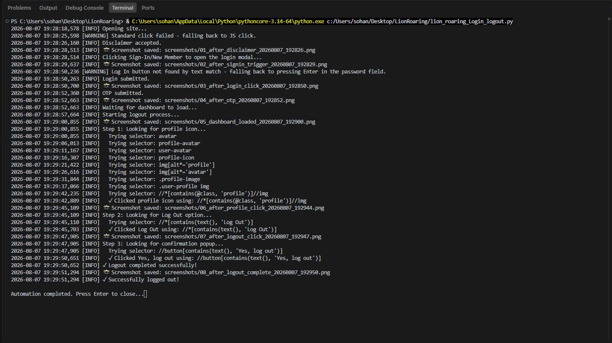

*Figure 5.1 – Successful execution of Login & Logout automation.*

### 5.2 Forgot Password Automation

**Objective:** Validate the Forgot Password workflow.

**Steps performed:**

1. Open login window
2. Click Forgot Password
3. Enter registered email
4. Submit password reset request
5. Validate success message

**Result:** Password reset request submitted successfully.

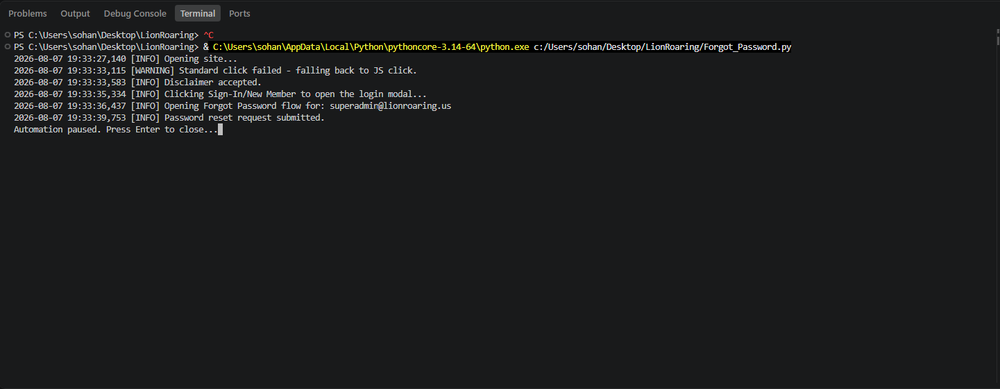

### 5.3 Add Member Automation

**Objective:** Automate member creation.

**Steps performed:**

1. Login
2. Navigate to Add Member
3. Populate user information
4. Populate personal information
5. Select administrator role
6. Assign permissions
7. Save member
8. Validate success

**Validation:** Member created successfully; success message displayed; screenshot captured.

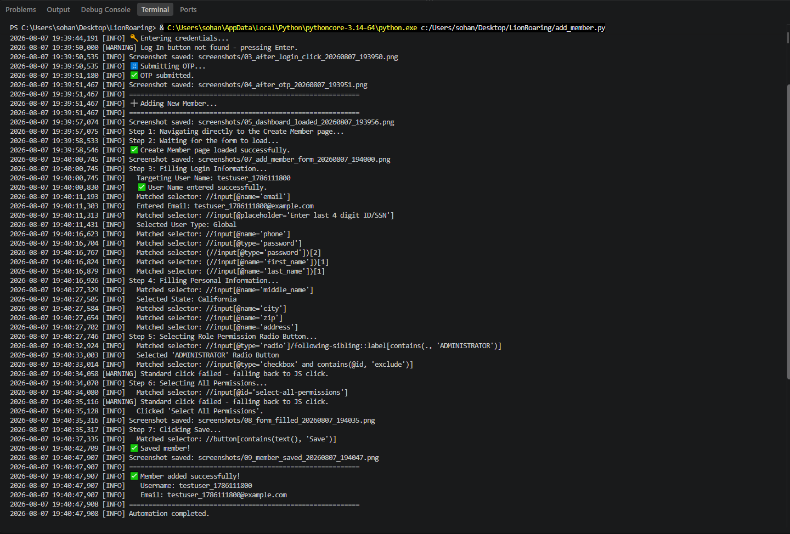

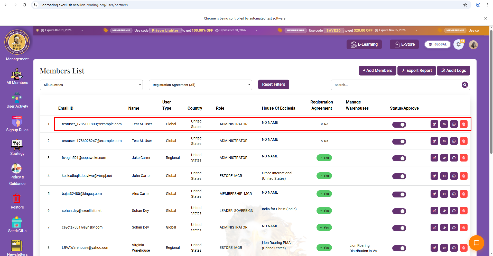

### 5.4 Role Permission Automation

**Objective:** Automate role creation.

**Steps performed:**

1. Navigate to Role Permission
2. Create new role
3. Assign permissions
4. Save role
5. Validate success

**Result:** Role Permission created successfully.

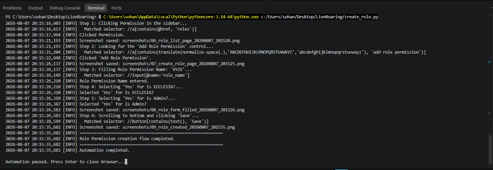

### 5.5 Membership Plan Automation

**Objective:** Automate creation of membership plans.

**Steps performed:**

1. Navigate to Membership Plans
2. Enter tier name
3. Configure pricing
4. Configure benefits
5. Save membership

**Result:** Membership tier created successfully.

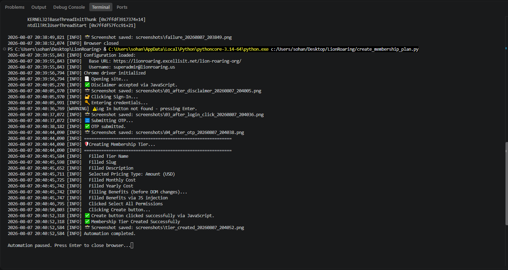

### 5.6 Membership Promo Code Automation

**Objective:** Automate membership promotional code creation.

**Workflow:**

1. Open Promo Code page
2. Populate details
3. Configure dates
4. Configure discount
5. Create promo code

**Result:** Promo code created successfully.

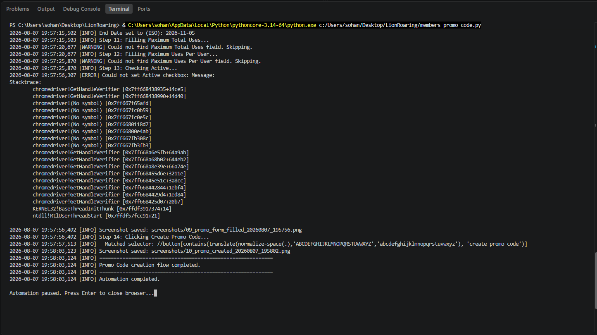

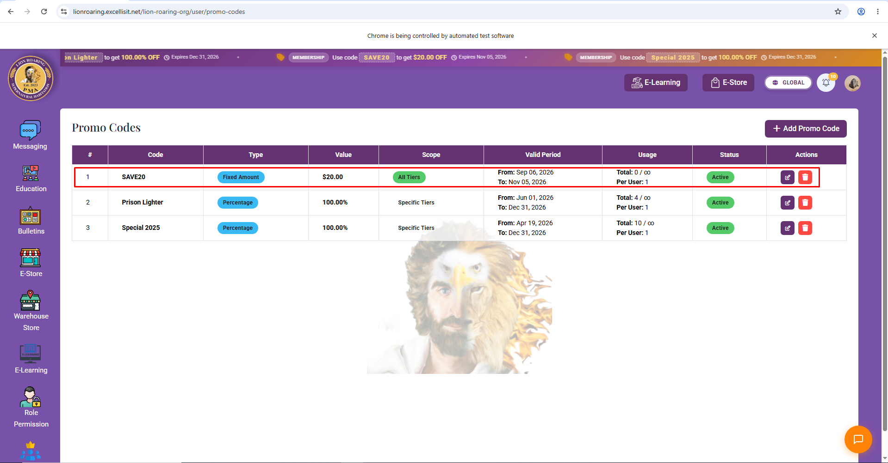

**Objective:** Automate promotional code management for the E-Store.

**Workflow:**

1. Open E-Store Promotion
2. Enter code details
3. Configure discount
4. Save

**Result:** E-Store promo code created successfully.

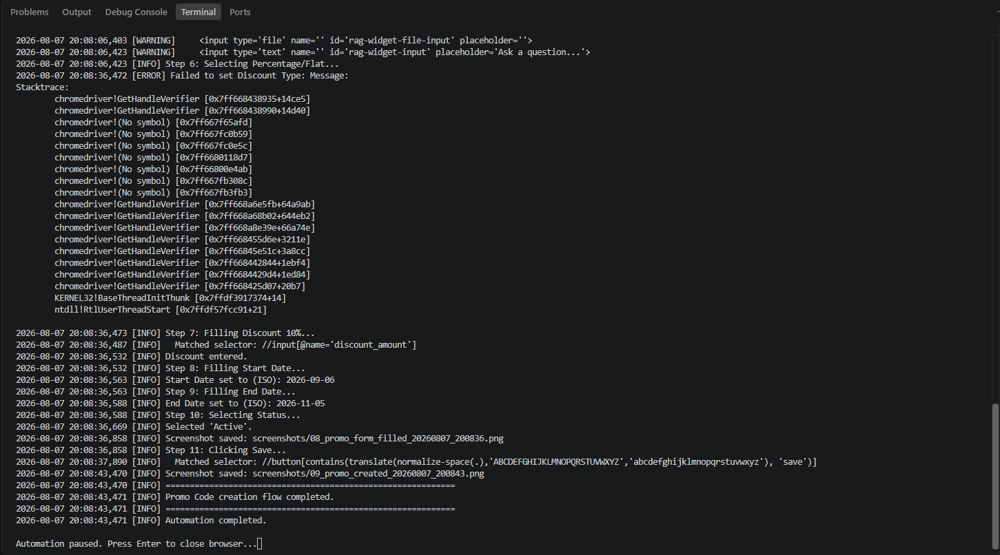

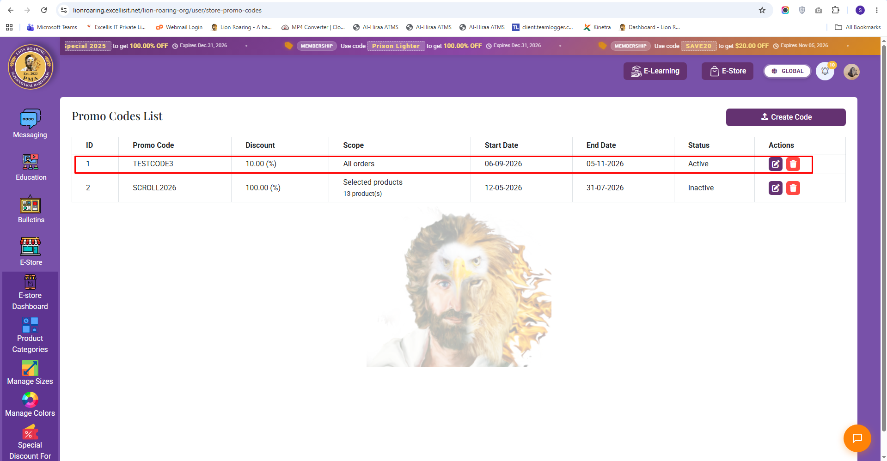

**Objective:** Validate the end-to-end E-Store purchase workflow by automating product selection, checkout navigation, and payment initiation.

**Workflow:**

1. Login to the application
2. Navigate to the E-Store
3. Search and select the desired product
4. Open the product details page
5. Proceed to checkout
6. Validate checkout page navigation
7. Attempt payment initiation

**Execution summary:** The automation successfully navigated to the E-Store, selected the target product, opened the product details page, added the product to the checkout flow, and navigated to the payment page. During the payment stage, the automation intentionally stopped before completing the transaction.

**Payment gateway limitation:** The Lion Roaring application uses a secure third-party payment gateway. For security and financial compliance reasons, the payment gateway requires real payment credentials and additional validations that are not suitable for execution within an automated regression test. The framework validates checkout navigation and payment initiation only; final payment confirmation is intentionally excluded to prevent unintended financial transactions during test execution. Errors when interacting with the protected payment card input field are expected and do not indicate a defect in the automation framework or the application under test.

| Validation item | Status |
|-----------------|--------|
| Login | Passed |
| Product search | Passed |
| Product selection | Passed |
| Checkout navigation | Passed |
| Checkout page validation | Passed |
| Payment initiation | Passed |
| Final payment transaction | Not executed (intentionally excluded) |

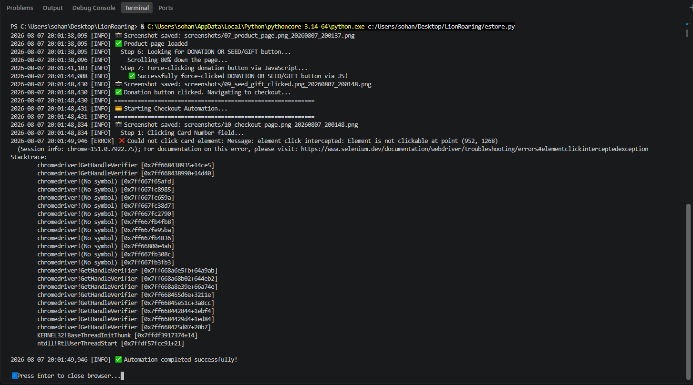

**Objective:** Validate automated chat messaging.

**Workflow:**

1. Navigate to Chats
2. Select contact
3. Enter message
4. Send message
5. Validate delivery

**Result:** Message delivered successfully.

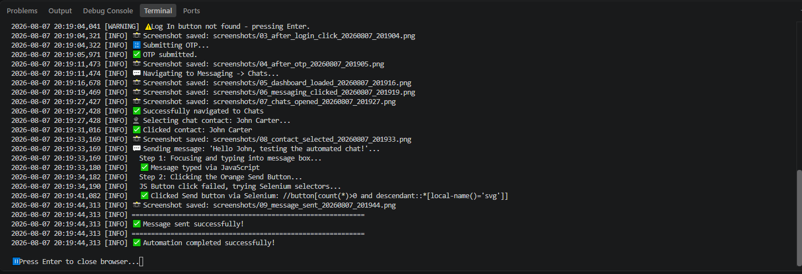

**Objective:** Validate search functionality.

**Features tested:** Name search, email search, dynamic search, reset filters.

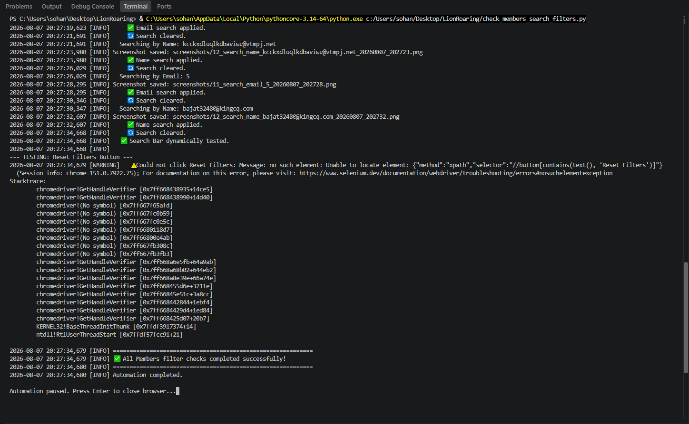

**Objective:** Validate member export functionality.

**Workflow:**

1. Navigate to Members
2. Click Export
3. Download report
4. Validate download

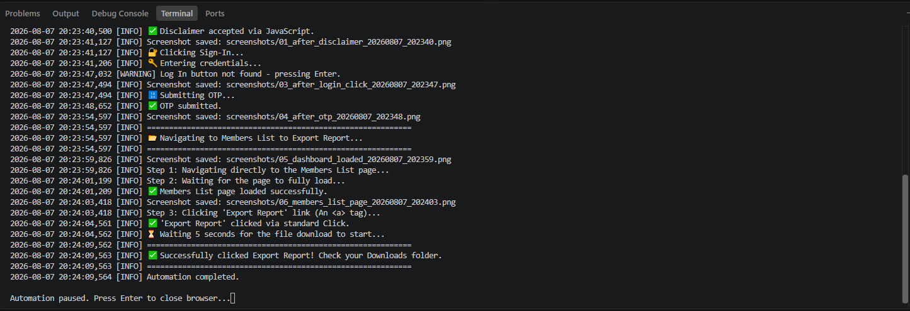

**Objective:** Validate audit log export.

**Workflow:**

1. Navigate to Audit Logs
2. Export report
3. Verify download

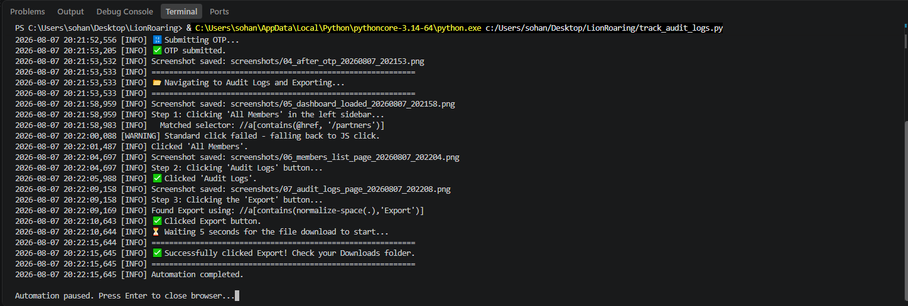

**Objective:** Validate user activity listing.

**Workflow:**

1. Open Activity List
2. Read activity records
3. Validate data

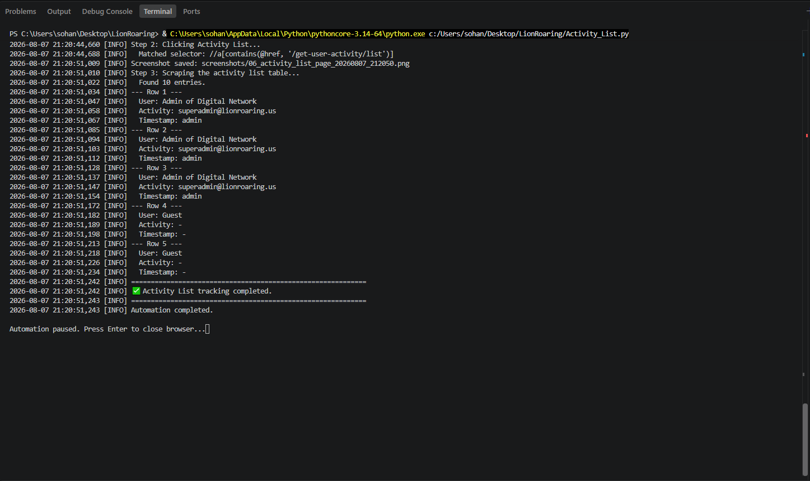

During execution, every automation module generates detailed logs that record each significant action, including page navigation, data entry, element interaction, validation results, warnings, and exceptions. Screenshots are captured automatically at important checkpoints and upon failures, providing execution evidence and supporting troubleshooting activities.

## 7. Error Handling

The framework incorporates robust error-handling mechanisms to improve execution stability.

Implemented strategies include:

- JavaScript click fallback when standard Selenium clicks are intercepted.
- Explicit wait conditions for dynamic page elements.
- Screenshot capture upon unexpected exceptions.
- Structured logging for error diagnosis.
- Graceful browser cleanup after execution.

## 8. Benefits

- Reduced manual regression effort.
- Faster validation of business-critical workflows.
- Improved execution consistency.
- Reusable automation components.
- Detailed execution logs and screenshots.
- Easier maintenance and scalability.

## 9. Future Enhancements

Potential enhancements include:

- Pytest integration.
- Allure reporting.
- Jenkins / GitHub Actions CI/CD integration.
- Parallel execution.
- Cross-browser automation.
- Email execution reports.

## 10. Conclusion

The Lion Roaring Automation Framework has successfully automated key administrative workflows within the application using a reusable Selenium-based architecture. The framework improves regression testing efficiency, reduces manual effort, and provides reliable execution evidence through structured logging and automated screenshots. Its modular design allows future business workflows to be incorporated with minimal changes, supporting the long-term scalability and maintainability of the automation solution.
